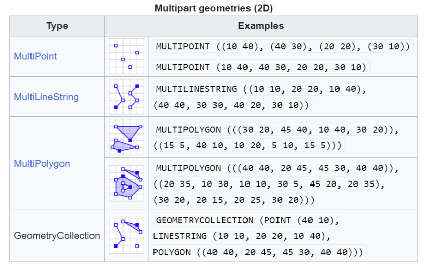

<small>
**survey_metadata** v2.0.0
</small>

!!! failure "Template Archived"

    This Template is archived, and is no longer available for use.

# SYSTEMATIC SURVEY METADATA TEMPLATE INSTRUCTIONS

## Intended Usage
This Systematic Survey Metadata template should be used to record metadata relating to a Systematic Survey dataset.

The Systematic Survey Metadata template **must be used in combination** with the
Systematic Survey Occurrence template and, in some cases, the Systematic Survey Site template
with or without the Systematic Survey Site Visit template.

Templates have been provided to facilitate integration of your data into the Biodiversity
Data Repository database. Not all types of data have been catered for in the available
templates at this stage; therefore, if you are unable to find a suitable template, please
contact <bdr-support@gaiaresources.com.au> to make us aware of your data needs.

## Data Validation Requirements:
For data validation, you will need your data file to:

- be the correct **file format**,
- have **fields that match the template downloaded** (do not remove, or 
  change the order of fields),
- have extant values for **mandatory fields** (see Table 1), and
- comply with all **data value constraints**; for example the geographic coordinates are
  consistent with a [geodeticDatum](#geodeticDatum-vocabularies) type of the ***5*** available
  options.
- only **one row of metadata** should be included and only the first row of metadata will be accepted
  (this symbolises one Survey per dataset submission).

Additional fields may be added **after the templated fields** (noting that the data type 
is not assumed and values will be encoded as strings).

### FILE FORMAT
- The systematic survey metadata template is a [UTF-8](#appendix-iv-utf-8) encoded csv (not Microsoft
Excel Spreadsheets). Be sure to save this file with your data as a .csv (UTF-8) as
follows, otherwise it will not pass the in-browser csv validation step upon upload.
 `[MS Excel: Save As > More options > Tools > Web options > Save this document as >
Unicode (UTF-8)]`
- **Do not include empty rows.**

### FILE NAME

When making a manual submission to the Biodiversity Data Repository,
the file name must include the version number
of this biodiversity data template (`v2.0.0`).
The following format is an example of a valid file name:

`data_descripion-v2.0.0-additional_description.csv`

where:

* `data_description`: A short description of the data (e.g. `survey_meta`, `test_data`).
* `v2.0.0`: The version number of this template.
* `additional_description`: (Optional) Additional description of the data, if needed (e.g. `test_data`).
* `.csv`: Ensure the file name ends with `.csv`.

For example, `survey_meta-v2.0.0-test_data.csv` or `test_data-v2.0.0.csv`

### FILE SIZE
MS Excel imposes a limit of 1,048,576 rows on a spreadsheet, limiting a CSV file to the
header row followed by 1,048,575 occurrences. Furthermore, MS Excel has a 32,767 character
limit on individual cells in a spreadsheet. These limits may be overcome by using or
editing CSV files with other software.

Larger datasets may be more readily ingested using the API interface. Please contact
<bdr-support@gaiaresources.com.au> to make us aware of your data needs.

## TEMPLATE FIELDS
The template file contains the field names in the top row that form part of the core Survey
data model. Table 1 will assist you in transferring your data to the template with the following
information:

- **Field name** in the template (and an external link to the Darwin Core standard for that
field where available);
- **Description** of the field;
- **Required** i.e. whether the field is **mandatory,
conditionally mandatory, or optional**;
- **Datatype format** required for the data values for example text (string), number
(integer, float), or date; and
- **Example/s** of an entry for that field.
- **Vocabulary links** within this document (for example pick list values) where relevant.
The fields that have suggested values options for the fields in Table 1 are listed in
Table 2 in alphabetical order of field name.

### ADDITIONAL FIELDS
Data that do not match the existing template fields may be added as additional columns in
the CSV files after the templated fields. 
For example, `sampleSizeUnit`, `sampleSizeValue`.

<ins>Table 1: Systematic Survey Metadata template fields with descriptions, conditions,
datatype format, and examples.</ins>

|Field #|Name|Description|Mandatory / Optional|Datatype Format|Examples|
|:---:|:---|:---|:---:|:---:|:---|
|1|surveyID|The identifier for the survey. Important if more there is more than one survey a the project.|Optional|String|COL1|
|2|surveyName|Brief title for the survey.|**Mandatory**|String|Disentangling the effects of farmland use, habitat edges, and vegetation structure on ground beetle morphological traits - Summer|
|3|surveyPurpose|A description of the survey objective|Optional|String|Summer sampling for peak insect diversity.|
|4|surveyType|Description of type of survey conducted|Optional|String|Wet pitfall trapping ([Vocabulary link](#surveyType-vocabularies))|
|5|surveyStart|The date data collection commenced.|**Mandatory**|Timestamp|21/09/2020|
|6|surveyEnd|The date data collection was completed.|Optional|Timestamp|23/09/2020|
|7|targetTaxonomicScope|The range of biological taxa covered by the survey. Multiple terms are allowed, separated by a vertical bar aka pipe \||Optional|List|Coleoptera \| Formicidae ([Vocabulary link](#targetTaxonomicScope-vocabularies))|
|8|targetHabitatScope|The habitats targeted for sampling during the survey. Multiple terms are allowed, separated by a vertical bar aka pipe \||Optional|List|Woodland ([Vocabulary link](#targetHabitatScope-vocabularies))|
|9|spatialCoverageWKT|Well Known Text (WKT) expression of the geographic coordinates that describe the survey's spatial extent. Ensure the coordinates are arranged in 'longitude latitude' order and do not include the CRS in the WKT expression (it comes from the geodeticDatum field).|**Mandatory if geodeticDatum is provided.**|WKT|POLYGON ((146.363 -33.826, 148.499 -33.826, 148.499 -34.411, 146.363 -33.826)) ([WKT notes](#appendix-ii-well-known-text-wkt))|
|10|[geodeticDatum](https://dwc.tdwg.org/terms/#dwc:geodeticDatum)|The geodetic datum upon which the geographic coordinates in the Spatial coverage (WKT) are based.|**Mandatory if spatialCoverageWKT is provided.**|String|GDA2020 ([Vocabulary link](#geodeticDatum-vocabularies))|
|11|surveyOrgs|Name of organisations or individuals for whom Survey is being conducted. Multiple terms are allowed, separated by a vertical bar aka pipe \||Optional|List|NSW Department of Planning, Industry and Environment \| CSIRO|
|12|surveyMethodCitation|A citation or reference to the survey methods used.|Optional|List|Ng, K., Barton, P.S., Blanchard, W. et al. Disentangling the effects of farmland use, habitat edges, and vegetation structure on ground beetle morphological traits. Oecologia 188, 645–657 (2018). https://doi.org/10.1007/s00442-018-4180-9|
|13|surveyMethodDescription|Free text description of the survey method used.|Optional|String|Our experimental design consisted of four 400 m transects running from inside each woodland patch out into four adjoining farmland uses (crop, rested, woody debris application, revegetation plantings). To quantify potential edge efects on beetle species traits, we sampled beetles at five locations along each transect: 200 and 20 m inside woodlands, 200 and 20 m inside farmlands, and at the woodland–farmland edge (0 m). Each sampling location comprised a pair of wet invertebrate pitfall traps.  separated by a drift fence (60 cm long x 10 cm high) to help direct arthropods into traps. We opened a total of 220 pairs of traps for 14 days during spring (Oct–Nov 2014), and repeated sampling during summer (January–February 2015). Beetle samples from each pitfall trap pair, and across the two time periods, were pooled to provide one sample per sampling location.|
|14|surveyMethodURL|A DOI or link to the reference about the survey method, if available.|Optional|List|https://biocollect.ala.org.au/document/download/2022-01/202201%20CBR%20Flora%20and%20Vegetation%20report_draftv1.pdf \| https://doi.org/10.1002/9781118945568.ch11|
|15|keywords|Terms, phrases or descriptors that highlight the key attributes of the study. Multiple terms are allowed, separated by a vertical bar aka pipe \||Optional|List|ground beetle \| habitat \| morphology \| traits \| farmland \| woodland \| remnant vegetation \| split-plot study|

## CHANGELOG

Changes from Systematic Survey Metadata Template v1.0.0

### CHANGED FIELDS

* `samplingPerformedBy` is removed.
* `samplingEffortValue` was moved to the Systematic Survey Site Visit Data Template.
* `samplingEffortUnit` was moved to the Systematic Survey Site Visit Data Template.

## APPENDICES
### APPENDIX-I: Vocabulary List
With the exception of `geodeticDatum`, data validation
does not require adherence to the vocabularies for the various vocabularied fields.. These vocabularies are provided as a
means of assistance in developing consistent language within the database. New terms can be added
to more appropriately describe your data that goes beyond the current list. 

Table 2 provides some
suggested values from existing sources such as: [Biodiversity Information Standard (TDWG)](https://dwc.tdwg.org/),
[EPSG.io Coordinate systems worldwide](https://epsg.io/), the [Global Biodiversity Information
System](https://rs.gbif.org/), and [Open Nomenclature in the biodiversity
era](https://doi.org/10.1111/2041-210X.12594).

<ins>Table 2: Suggested values for the controlled vocabulary fields in the template. Each term has
a preferred label with a definition to aid understanding of its meaning. For some terms, alternative
labels with similar semantics are provided.  Note: the value for `geodeticDatum`
must come from one of five options in this table.</ins>

|Template field name|Preferred label|Definition|Alternate label|
|:---|:---|:---|:---|
|geodeticDatum|AGD66|Australian Geodetic Datum 1966|EPSG:4202|
|geodeticDatum|AGD84|Australian Geodetic Datum 1984|EPSG:4203|
|geodeticDatum|GDA2020|Geocentric Datum of Australia 2020|EPSG:7844|
|geodeticDatum|GDA94|Geocentric Datum of Australia 1994|EPSG:4283|
|geodeticDatum|WGS84|World Geodetic System 1984, used in GPS|EPSG:4326|
|surveyType|WET PITFALL TRAPPING|The type/method of invertebrate fauna sampling implemented. Wet pitfall trapping consists of a grid of 20 traps (specimen containers), dug into the ground so they are flush with the soil surface, and partially filled with a liquid preservative to rapidly kill the invertebrates that fall in. The trap grid is established anywhere within the plot, consisting of 4 north-south rows of 5 traps, spaced 10 m apart.||
|targetHabitatScope|BEACH|Type of Landform Element, which is usually short; low; very wide slope; gently or moderately inclined; built up or eroded by waves; forming the shore of a lake or sea.||
|targetHabitatScope|BILLABONG OR SWAMP|A swamp is a wetland that features temporary or permanent inundation of large areas of land by shallow bodies of water, generally with a substantial number of hammocks, or dry-land protrusions, and covered by aquatic vegetation, or vegetation that tolerates periodical inundation.||
|targetHabitatScope|CAVE|The type of habitat representative of a naturally formed, subterranean open area or chamber.||
|targetHabitatScope|CHENOPOD SHRUBLAND|Refers to the NVIS dominant vegetation structural formation class, with a percent cover of about 50-80% members of Chenopodiaceae.||
|targetHabitatScope|CLOSED CHENOPOD SHRUBLAND|Refers to the NVIS dominant vegetation structural formation class, with a percent cover of about >80% members of Chenopodiaceae.||
|targetHabitatScope|CLOSED FERNLAND|Refers to the NVIS dominant vegetation structural formation class, with a percent cover of about >80% members of Fern and Fern-allies.||
|targetHabitatScope|CLOSED FORBLAND|Refers to the NVIS dominant vegetation structural formation class, with a percent cover of about >80% members of Forbs or herbs other than grasses.||
|targetHabitatScope|CLOSED FOREST|Refers to the NVIS dominant vegetation structural formation class, with a percent cover of about >80% members of Forbs or herbs other than grasses.||
|targetHabitatScope|CLOSED HEATHLAND|Refers to the NVIS dominant vegetation structural formation class, with a percent cover of about >80% members of heath shrubs (e.g., members of Ericaceae, Myrtaceae).||
|targetHabitatScope|CLOSED HUMMOCK GRASSLAND|Refers to the NVIS dominant vegetation structural formation class, with a percent cover of about >80% members of hummock (e.g., Triodia) grasses.||
|targetHabitatScope|CLOSED LICHENLAND|Refers to the type of habitat characterised by lichenised tree trunks and rocks.||
|targetHabitatScope|CLOSED LIVERWORTLAND|Refers to the type of habitat characterised by lower plant groups such as moss, liverworts and bryophytes.||
|targetHabitatScope|CLOSED MALLEE FOREST|Refers to the NVIS dominant vegetation structural formation class, with a percent cover of about >80% members of tree mallee (e.g., some members of Eucalyptus).||
|targetHabitatScope|CLOSED MALLEE SHRUBLAND|Refers to the NVIS dominant vegetation structural formation class, with a percent cover of about >80% members of mallee shrubs (e.g., some members of Eucalyptus).||
|targetHabitatScope|CLOSED MOSSLAND|Refers to the type of habitat characterised by lower plant groups such as moss, liverworts and bryophytes.||
|targetHabitatScope|CLOSED RUSHLAND|Refers to the NVIS dominant vegetation structural formation class, with a percent cover of about >80% members of Rushes (e.g., Juncaceae).||
|targetHabitatScope|CLOSED SEDGELAND|Refers to the NVIS dominant vegetation structural formation class, with a percent cover of about >80% members of sedges (e.g., Cyperaceae).||
|targetHabitatScope|CLOSED SHRUBLAND|Refers to the NVIS dominant vegetation structural formation class, with a percent cover of about >80% members of sedges (e.g., Cyperaceae).||
|targetHabitatScope|CLOSED SOD GRASSLAND|Refers to the type of habitat representative of a characteristic sod-like (turf) grass.||
|targetHabitatScope|CLOSED TUSSOCK GRASSLAND|Refers to the NVIS dominant vegetation structural formation class, with a percent cover of about >80% members of tussock grasses (e.g., Poa).||
|targetHabitatScope|CLOSED VINELAND|Refers to the type of habitat represented by a closed vegetation dominated by stragglers and woody climbers.||
|targetHabitatScope|COASTAL WATERS|Refers to the type of habitat representative of an aquatic body typically characterized by a shallow continental shelf, gently sloping seaward to a continental slope, which drops relatively abruptly to the deep ocean.||
|targetHabitatScope|CROP LAND|Refers to the type of habitat representative of a cultivated land or land on which agricultural crops are grown or land that is set aside or temporarily not being used for crop production.||
|targetHabitatScope|ESTUARY|Type of Landform Element which has a stream channel close to its junction with a sea or lake; where the action of channelled stream flow is modified by tide and waves. The width typically increases downstream.||
|targetHabitatScope|FERNLAND|Refers to the NVIS dominant vegetation structural formation class, with a percent cover of about 50-80% members of Fern and Fern-allies.||
|targetHabitatScope|FORBLAND|Refers to the NVIS dominant vegetation structural formation class, with a percent cover of about 50-80% members of Forbs or herbaceous plants other than grasses.||
|targetHabitatScope|FRESHWATER LAKE|Refers to the type of habitat representative of an enclosed aquatic body having a relatively low mineral content, generally less than 500 mg/l of dissolved solids.||
|targetHabitatScope|GRAZING LAND|Refers to the type of habitat representative of a land predominantly used for grazing.||
|targetHabitatScope|HEATHLAND|Refers to the NVIS dominant vegetation structural formation class, with a percent cover of about 50-80% members of Heath (e.g., Ericaceae, Myrtaceae).||
|targetHabitatScope|HUMMOCK GRASSLAND|Refers to the NVIS dominant vegetation structural formation class, with a percent cover of about 50-80% members of hummock grasses (e.g., Triodia).||
|targetHabitatScope|ISOLATED CHENOPOD SHRUBS|Refers to the NVIS dominant vegetation structural formation class, with a percent cover of about <0.25% members of Chenopodiaceae.||
|targetHabitatScope|ISOLATED CLUMP OF CHENOPOD SHRUBS|Refers to the type of habitat characterised by isolated clumps of chenopod shrubs.||
|targetHabitatScope|ISOLATED CLUMP OF HEATH SHRUBS|Refers to the type of habitat characterised by isolated clumps of heath or heath-like shrubs.||
|targetHabitatScope|ISOLATED CLUMP OF HUMMOCK GRASSES|Refers to the type of habitat characterised by isolated clumps of hummocky grass (e.g., Triodia spp., Spinifex spp.).||
|targetHabitatScope|ISOLATED CLUMP OF LIVERWORTS|Refers to the type of habitat characterised by isolated clumps of bryophytes, moss and liverworts.||
|targetHabitatScope|ISOLATED CLUMP OF MALLEE SHRUBS|Refers to the type of habitat characterised by isolated clumps of mallee shrubs (members of Eucalyptus spp., multistemmed from base).||
|targetHabitatScope|ISOLATED CLUMP OF MALLEE TREES|Refers to the type of habitat characterised by isolated clumps of tree mallee (members of Eucalyptus spp., multistemmed from base).||
|targetHabitatScope|ISOLATED CLUMP OF MOSSES|Refers to the type of habitat characterised by isolated clumps of bryophytes, moss and liverworts.||
|targetHabitatScope|ISOLATED CLUMP OF RUSHES|Refers to the type of habitat characterised by isolated clumps of rushes.||
|targetHabitatScope|ISOLATED CLUMP OF SEDGES|Refers to the type of habitat characterised by isolated clumps of sedges.||
|targetHabitatScope|ISOLATED CLUMP OF SHRUBS|Refers to the type of habitat characterised by isolated clumps of shrubs.||
|targetHabitatScope|ISOLATED CLUMP OF SOD GRASSES|Refers to the type of habitat characterised by isolated clumps of sod grass.||
|targetHabitatScope|ISOLATED CLUMP OF TREES|Refers to the type of habitat characterised by isolated clumps of trees.||
|targetHabitatScope|ISOLATED CLUMP OF TUSSOCK GRASSES|Refers to the type of habitat characterised by isolated clumps of tussock grasses (e.g., Poa spp).||
|targetHabitatScope|ISOLATED CLUMP OF VINES|Refers to the type of habitat characterised by isolated clumps of vines.||
|targetHabitatScope|ISOLATED CLUMPS OF FERNS|Refers to the NVIS dominant vegetation structural formation class, with a percent cover of about 0-5% members of Fern and Fern-allies.||
|targetHabitatScope|ISOLATED CLUMPS OF FORBS|Refers to the NVIS dominant vegetation structural formation class, with a percent cover of about 0-5% members of Forbs or herbs other than grasses.||
|targetHabitatScope|ISOLATED CLUP OF LICHENS|Refers to the type of habitat characterised by isolated clumps of lichens.||
|targetHabitatScope|ISOLATED FERNS|Refers to the NVIS dominant vegetation structural formation class, with a percent cover of about <0.25% of fern and fern allies.||
|targetHabitatScope|ISOLATED FORBS|Refers to the NVIS dominant vegetation structural formation class, with a percent cover of about <0.25% of forbs or herbs other than grasses.||
|targetHabitatScope|ISOLATED HEATH SHRUBS|Refers to the NVIS dominant vegetation structural formation class, with a percent cover of about <0.25% of heath shrubs (e.g., Ericaceae, Myrtaceae).||
|targetHabitatScope|ISOLATED HUMMOCK GRASSES|Refers to the NVIS dominant vegetation structural formation class, with a percent cover of about <0.25% of hummock grasses (e.g., Triodia).||
|targetHabitatScope|ISOLATED LICHENS|Refers to the type of habitat characterised by isolated or sparse lichens.||
|targetHabitatScope|ISOLATED LIVERWORTS|Refers to the type of habitat characterised by isolated or sparse liverworts.||
|targetHabitatScope|ISOLATED MALLEE SHRUBS|Refers to the NVIS dominant vegetation structural formation class, with a percent cover of about <0.25% of mallee shrubs (e.g., some multistemmed individuals from base of Eucalyptus).||
|targetHabitatScope|ISOLATED MALLEE TREES|Refers to the NVIS dominant vegetation structural formation class, with a percent cover of about <0.25% of tree mallee (e.g., some multistemmed individuals from base of Eucalyptus).||
|targetHabitatScope|ISOLATED MOSSES|Refers to the type of habitat characterised by isolated mosses, including bryophytes and liverworts.||
|targetHabitatScope|ISOLATED RUSHES|Refers to the NVIS dominant vegetation structural formation class, with a percent cover of about <0.25% of rushes (e.g., Juncaceae).||
|targetHabitatScope|ISOLATED SEDGES|Refers to the NVIS dominant vegetation structural formation class, with a percent cover of about <0.25% of sedges (e.g., Cyperaceae).||
|targetHabitatScope|ISOLATED SHRUBS|Refers to the NVIS dominant vegetation structural formation class, with a percent cover of about <0.25% of shrubs including cycads, grass-tree and tree-fern.||
|targetHabitatScope|ISOLATED SOD GRASSES|Refers to the type of habitat characterised by isolated or sparse sod or turf-like grasses.||
|targetHabitatScope|ISOLATED TREES|Refers to the NVIS dominant vegetation structural formation class, with a percent cover of about <0.25% of trees including palms.||
|targetHabitatScope|ISOLATED TUSSOCK GRASSES|Refers to the NVIS dominant vegetation structural formation class, with a percent cover of about <0.25% of tussock grass (e.g. Poa species).||
|targetHabitatScope|ISOLATED VINES|Refers to the type of habitat characterised by isolated or sparse stragglers or climbing woody vines.||
|targetHabitatScope|LICHENLAND|Refers to the type of habitat predominated by lichens on rocks, trees or tree stumps, etc.||
|targetHabitatScope|LIVERWORTLAND|Refers to the type of habitat predominated by liverworts.||
|targetHabitatScope|MALLEE SHRUBLAND|Refers to the NVIS dominant vegetation structural formation class, with a percent cover of about 50-80% of shrub mallee (e.g., individuals of some Eucalypts multistemmed from base).||
|targetHabitatScope|MALLEE WOODLAND|Refers to the dominant vegetation structural formation, with a percent cover of about 20-50% of Tree Mallee.||
|targetHabitatScope|MOSSLAND|Refers to the type of habitat dominated by mosses.||
|targetHabitatScope|MUDFLAT|Refers to the type of habitat characterised by a wetland that forms when mud is deposited by the tides, rivers, sea or oceans.||
|targetHabitatScope|OPEN CHENOPOD SHRUBLAND|Refers to the NVIS dominant vegetation structural formation class, with a percent cover of about 20-50% of members of Chenopodiaceae.||
|targetHabitatScope|OPEN FERNLAND|Refers to the NVIS dominant vegetation structural formation class, with a percent cover of about 20-50% of ferns and fern allies.||
|targetHabitatScope|OPEN FORBLAND|Refers to the NVIS dominant vegetation structural formation class, with a percent cover of about 20-50% of forbs or herbs other than grasses.||
|targetHabitatScope|OPEN FOREST|Refers to the NVIS dominant vegetation structural formation class, with a percent cover of about 20-50% of trees including palms.||
|targetHabitatScope|OPEN HEATH|Refers to the NVIS dominant vegetation structural formation class, with a percent cover of about 20-50% of heaths (e.g., Ericaceae, Myrtaceae).||
|targetHabitatScope|OPEN HUMMOCK GRASSLAND|Refers to the NVIS dominant vegetation structural formation class, with a percent cover of about 20-50% of hummock grasses (e.g., Triodia).||
|targetHabitatScope|OPEN LICHENLAND|Refers to the type of habitat represented by open or sparse (i.e., 10-30%) hummocky grasses (e.g., Spinifex spp., Triodia spp.).||
|targetHabitatScope|OPEN LIVERWORTLAND|Refers to the type of habitat characterised by open or sparse lichenised tree trunks and rocks.||
|targetHabitatScope|OPEN MALLEE FOREST|Refers to the NVIS dominant vegetation structural formation class, with a percent cover of about 50-80% of tree Mallee (e.g., certain individuals of Eucalypts multistemmed from base).||
|targetHabitatScope|OPEN MALLEE SHRUBLAND|Refers to the NVIS dominant vegetation structural formation class, with a percent cover of about 20-50% of Mallee shrubs (e.g., certain individuals of Eucalypts multistemmed from base).||
|targetHabitatScope|OPEN MALLEE WOODLAND|Refers to the NVIS dominant vegetation structural formation class, with a percent cover of about 0.25-20% of tree mallee (e.g., certain individuals of Eucalypts multistemmed from base).||
|targetHabitatScope|OPEN MOSSLAND|Refers to the type of habitat characterised by open or sparse members of lower plant groups such as moss, liverworts and bryophytes.||
|targetHabitatScope|OPEN OCEAN|Refers to the type of habitat surrounded by ocean, i.e., a continuous saline-water bodies that surround the continents and fill the Earth's great depressions.||
|targetHabitatScope|OPEN RUSHLAND|Refers to the NVIS dominant vegetation structural formation class, with a percent cover of about 20-50% of rushes (e.g. Juncaceae).||
|targetHabitatScope|OPEN SEDGELAND|Refers to the NVIS dominant vegetation structural formation class, with a percent cover of about 20-50% of sedges (e.g. Cyperaceae).||
|targetHabitatScope|OPEN SHRUBLAND|Refers to the NVIS dominant vegetation structural formation class, with a percent cover of about 20-50% of shrubs (e.g. shrubs, cycads, grass-tree, tree-fern).||
|targetHabitatScope|OPEN SOD GRASSLAND|Refers to the type of habitat characterised by open or sparse (10-30% ground cover) of a characteristic sod-like (turf) grass.||
|targetHabitatScope|OPEN TUSSOCK GRASSLAND|Refers to the NVIS dominant vegetation structural formation class, with a percent cover of about 20-50% of tussock grasses (e.g. Poa species).||
|targetHabitatScope|OPEN VINELAND|Refers to the type of habitat represented by a closed vegetation dominated by stragglers and woody climbers.||
|targetHabitatScope|OPEN WOODLAND|Refers to the NVIS dominant vegetation structural formation class, with a percent cover of about 0.25-20% of trees including palms.||
|targetHabitatScope|ROCK OUTCROP|Refers to the type of habitat characterised by rocks, which protrudes through the surface layer.||
|targetHabitatScope|RUSHLAND|Refers to the NVIS dominant vegetation structural formation class, with a percent cover of about 50-80% of rushes (e.g. Juncaceae).||
|targetHabitatScope|SALTWATER LAKE|Refers to the type of habitat representative of an aquatic body filled with water (with high salinity) of considerable size contained in a depression on a landmass.||
|targetHabitatScope|SEDGELAND|Refers to the NVIS dominant vegetation structural formation class, with a percent cover of about 50-80% of sedges (e.g., Cyperaceae).||
|targetHabitatScope|SHRUBLAND|Refers to the NVIS dominant vegetation structural formation class, with a percent cover of about 50-80% of shrubs (e.g., shrub, cycad, grass-tree, tree-fern).||
|targetHabitatScope|SOD GRASSLAND|Refers to the type of habitat characterised by mid-dense (30-70% cover) sod or turf-like grasses.||
|targetHabitatScope|SPARSE CHENOPOD SHRUBLAND|Refers to the NVIS dominant vegetation structural formation class, with a percent cover of about 0.25-20% of members of Chenopodiaceae.||
|targetHabitatScope|SPARSE FERNLAND|Refers to the NVIS dominant vegetation structural formation class, with a percent cover of about 0.25-20% of members of fern and fern-allies.||
|targetHabitatScope|SPARSE FORBLAND|Refers to the NVIS dominant vegetation structural formation class, with a percent cover of about 0.25-20% of members of forbs and herbs other than grasses.||
|targetHabitatScope|SPARSE GRASSLAND|Refers to the NVIS dominant vegetation structural formation class, with a percent cover of about 0.25-20% of grasses.||
|targetHabitatScope|SPARSE HEATH|Refers to the NVIS dominant vegetation structural formation class, with a percent cover of about 0.25-20% of members of heath (e.g., Ericaceae, Myrtaceae).||
|targetHabitatScope|SPARSE LICHENLAND|Refers to the type of habitat characterised by very sparse (<10% cover) lichens.||
|targetHabitatScope|SPARSE LIVERWORTLAND|Refers to the type of habitat characterised by very sparse (<10% cover) liverworts.||
|targetHabitatScope|SPARSE MALLEE SHRUBLAND|Refers to the NVIS dominant vegetation structural formation class, with a percent cover of about 0.25-20% of members of shrub Mallee.||
|targetHabitatScope|SPARSE MOSSLAND|Refers to the type of habitat characterised by very sparse (<10% cover) mosses.||
|targetHabitatScope|SPARSE RUSHLAND|Refers to the NVIS dominant vegetation structural formation class, with a percent cover of about 0.25-20% of rushes (e.g., Juncaceae).||
|targetHabitatScope|SPARSE SEDGELAND|Refers to the NVIS dominant vegetation structural formation class, with a percent cover of about 0.25-20% of sedges (e.g., Cyperaceae).||
|targetHabitatScope|SPARSE SHRUBLAND|Refers to the NVIS dominant vegetation structural formation class, with a percent cover of about 0.25-20% of shrubs, including cycad, grass-tree, tree-fern.||
|targetHabitatScope|SPARSE SOD GRASSLAND|Refers to the type of habitat characterised by very sparse (<10% cover) sod or turf-like grasses.||
|targetHabitatScope|SPARSE TUSSOCK GRASSLAND|Refers to the NVIS dominant vegetation structural formation class, with a percent cover of about 0.25-20% of tussock grass (e.g., Poa species).||
|targetHabitatScope|SPARSE VINELAND|Refers to the type of habitat characterised by well separated or very sparse crown stragglers or woody vines.||
|targetHabitatScope|STREAM OR RIVER|Refers to the type of habitat representative of an aquatic body with a watercourse which is linear and flows across the solid portion of a planetary surface.||
|targetHabitatScope|TUSSOCK GRASSLAND|Refers to the NVIS dominant vegetation structural formation class, with a percent cover of about 50-80% of tussock grass (e.g., Poa species).||
|targetHabitatScope|URBAN|Refers to the type of habitat relating to, located in, or characteristic of a city or densely populated area.||
|targetHabitatScope|VINELAND|Refers to the type of habitat characterised by woody climbers/straggling vines.||
|targetHabitatScope|WOODLAND|Refers to the type of habitat characterised by a low-density forest forming open habitats with plenty of sunlight and limited shade.||
|targetTaxonomicScope|AMPHIBIAN|Refers to the target taxa studied in a fauna survey. Amphibians are vertebrates belonging to the class amphibia such as frogs, toads, newts and salamanders that live in a semi-aquatic environment.||
|targetTaxonomicScope|BIRD|Refers to the target taxa studied in a fauna survey.Warm-blooded vertebrates possessing feather and belonging to the class Aves.||
|targetTaxonomicScope|INVERTEBRATE|Refers to the target taxa studied in a fauna survey.Animals that have no spinal column (e.g., insects, molluscs, spiders).||
|targetTaxonomicScope|MAMMALS|Refers to the target taxa studied in a fauna survey. Warm-blooded vertebrate animals belonging to the class Mammalia, including all that possess hair and suckle their young. Warm-blooded vertebrate animals belonging to the class Mammalia, including all that possess hair and suckle their young.||
|targetTaxonomicScope|NON-VASCULAR PLANT|Refers to the target taxa studied in a fauna survey. Non-vascular plants are plants that do not possess a true vascular tissue (such as xylem-water conducting, phloem-sugar transport). Instead, they may possess simpler tissues that have specialized functions for the internal transport of food and water. They are members of bryophytes for example.||
|targetTaxonomicScope|REPTILE|Refers to the target taxa studied in a fauna survey.Cold-blooded, air-breathing Vertebrates belonging to the class Reptilia, usually covered with external scales or bony plates.||
|targetTaxonomicScope|VASCULAR PLANT|Refers to the target taxa studied in a fauna survey. Vascular plants are plants that possess a true vascular tissue (such as xylem-water conducting, phloem-sugar transport). Examples include some members mosses, such as club moss, horsetails, and pteridophytes such as ferns an fern-allies, gymnosperms (including conifers), and angiosperms (flowering plants).||

### APPENDIX-II: Well Known Text (WKT)
For general information on how WKT coordinate reference data is formatted is available [here](https://en.wikipedia.org/wiki/Well-known_text_representation_of_geometry).
The length of a WKT string or of its components is not prescribed; however, MS Excel *does* has a
32,767 (32K) character limit on individual cells in a spreadsheet.

It is possible to edit CSV files outside of Excel in order to include more than 32K characters.

**Note:** Ensure the coordinates are arranged in `longitude latitude` order and do not include the CRS in the WKT expression (it comes from the geodeticDatum field).

 
<small>*Source: Mwtoews - CC BY-SA 3.0 -  Wikipedia <https://en.wikipedia.org/wiki/Well-known_text_representation_of_geometry>*</small>

### APPENDIX-III: Timestamp
Following date and date-time formats are acceptable within the timestamp:

| TYPE | FORMAT                                                                                                                              |
| --- |-------------------------------------------------------------------------------------------------------------------------------------|
| **xsd:dateTimeStamp with timezone** | yyyy-mm-ddThh:mm:ss.sTZD (eg 1997-07-16T19:20:30.45+01:00) OR   yyyy-mm-ddThh:mm:ssTZD (eg 1997-07-16T19:20:30+01:00) OR    yyyy-mm-ddThh:mmTZD (eg 1997-07-16T19:20+01:00)|
| **xsd:dateTime** | yyyy-mm-ddThh:mm:ss.s (eg 1997-07-16T19:20:30.45) OR  yyyy-mm-ddThh:mm:ss (eg 1997-07-16T19:20:30) OR  yyyy-mm-ddThh:mm (eg 1997-07-16T19:20) |
| **xsd:Date** | dd/mm/yyyy OR  d/m/yyyy OR  yyyy-mm-dd OR  yyyy-m-d |
| **xsd:gYearMonth** | mm/yyyy OR  m/yyyy OR  yyyy-mm |
| **xsd:gYear** | yyyy |

Where: 
&emsp; `yyyy`: four-digit year  
&emsp; `mm`: two-digit month (01=January, etc.)  
&emsp; `dd`: two-digit day of month (01 through 31)  
&emsp; `hh`: two digits of hour (00 through 23) (am/pm NOT allowed)  
&emsp; `mm`: two digits of minute (00 through 59)  
&emsp; `ss`: two digits of second (00 through 59)  
&emsp; `s`: one or more digits representing a decimal fraction of a second  
&emsp; `TZD`: time zone designator (Z or +hh:mm or -hh:mm)  

### APPENDIX-IV: UTF-8
UTF-8 encoding is considered a best practice for handling character encoding, especially in
the context of web development, data exchange, and modern software systems. UTF-8
(Unicode Transformation Format, 8-bit) is a variable-width character encoding capable of
encoding all possible characters (code points) in Unicode. 
Here are some reasons why UTF-8 is recommended:

- **Universal Character Support:** UTF-8 can represent almost all characters from all writing 
  systems in use today. This includes characters from various languages, mathematical symbols, 
  and other special characters.
- **Backward Compatibility:** UTF-8 is backward compatible with ASCII (American
  Standard Code for Information Interchange). The first 128 characters in UTF-8 are
  identical to ASCII, making it easy to work with systems that use ASCII.
- **Efficiency:** UTF-8 is space-efficient for Latin-script characters (common in English
  and many other languages). It uses one byte for ASCII characters and up to four
  bytes for other characters. This variable-length encoding minimises storage and
  bandwidth requirements.
- **Web Standards:** UTF-8 is the dominant character encoding for web content. It is
  widely supported by browsers, servers, and web-related technologies.
- **Globalisation:** As software applications become more globalised, supporting a wide
  range of languages and scripts becomes crucial. UTF-8 is well-suited for
  internationalisation and multilingual support.
- **Compatibility with Modern Systems:** UTF-8 is the default encoding for many
  programming languages, databases, and operating systems. Choosing UTF-8 helps
  ensure compatibility across different platforms and technologies.

When working with text data, UTF-8 encoding is recommended to avoid issues related to character
representation and ensure that a diverse set of characters and languages is supported.

For assistance, please contact: <bdr-support@gaiaresources.com.au>

